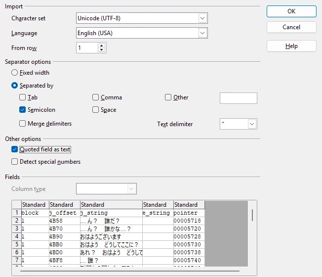
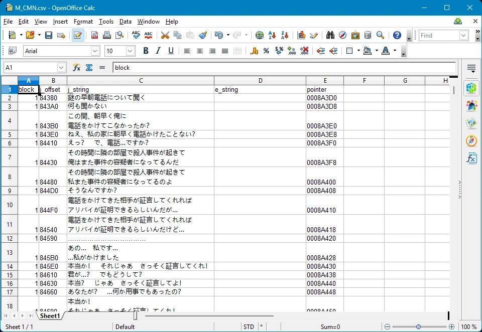
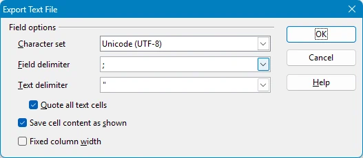

## How to work with csv files:
#### Step 1:
Import csv text file into spreadsheet editor of your choice using these settings.\

#### Step 2:
Put desired text into "e_string" field.\

#### Step 3:
Export edited file using these settings.\

#### Fields Explanation:
* block - which block of text particular string resides in.
* j_offset - address of original string.
* j_string - original string.
* e_string - translated string.
* pointer - address of pointer to the string.

